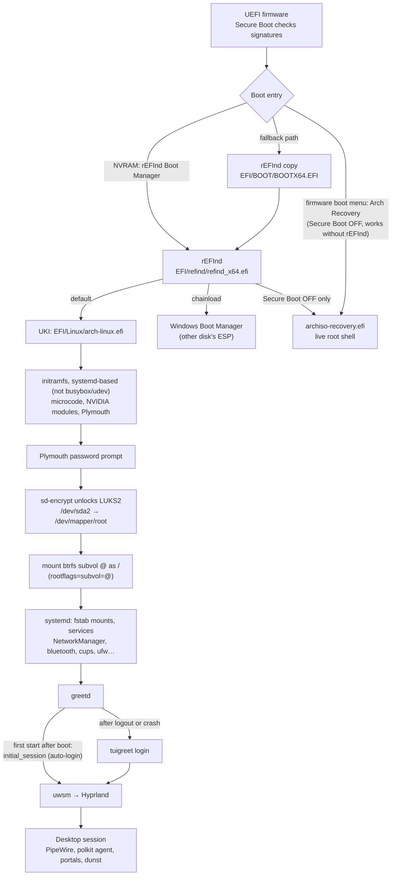
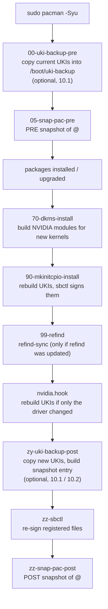
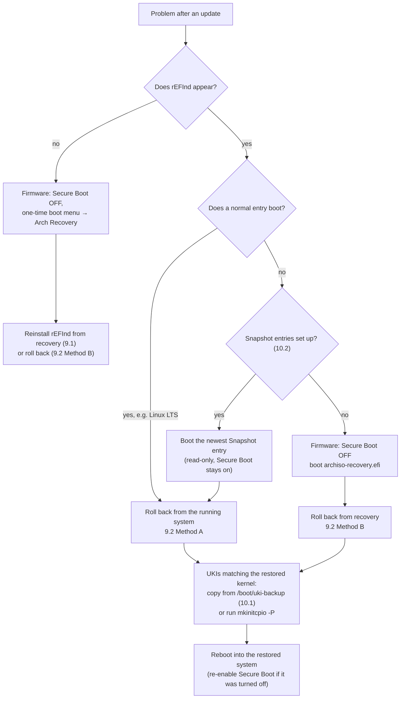
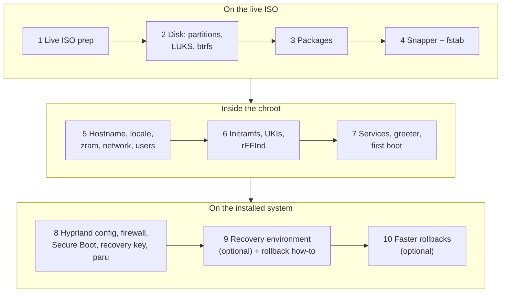

# 0. Overview: what you're building

This guide is opinionated. Before running any command, this page shows the finished system: which piece does what, how the disk and the EFI partition are laid out, what happens at boot and on every update, and how recovery works. Every section links to the chapter that builds it.

## The choices at a glance

| Area | This guide uses | Why | Common alternative |
|---|---|---|---|
| Boot manager | **rEFInd** | Auto-detects UKIs, clean submenus, chainloads Windows | systemd-boot, GRUB, Limine |
| Kernel image | **UKI** (kernel + initramfs + cmdline in one `.efi`), built by mkinitcpio + `ukify` | One signed file per kernel; simple Secure Boot | separate `vmlinuz` + `initramfs.img` |
| Initramfs | **systemd-based** (`systemd`, `sd-encrypt`, `sd-vconsole` hooks) instead of busybox + udev | Same init system in early boot and after; better Plymouth prompt; keeps TPM2/FIDO2 unlock possible | busybox + `udev` + `encrypt` (archinstall's default) |
| Kernels | `linux` + `linux-lts` | LTS is a known-good fallback after a bad update | single kernel |
| Secure Boot | **sbctl**, your own keys + Microsoft's | Only files you signed (plus Windows / GPU firmware) can boot | Secure Boot off, or shim |
| Encryption | **LUKS2**, password at a Plymouth prompt | One password per boot; nothing readable while powered off | TPM auto-unlock, TPM + PIN |
| Login | greetd **auto-login** after unlock; tuigreet as fallback | No second password prompt | SDDM/GDM, manual login |
| Filesystem | **btrfs** with 5 subvolumes, zstd compression | Cheap snapshots, per-area rollback | ext4 |
| Snapshots | **Snapper** + snap-pac, flat `@snapshots` | A snapshot before and after every pacman run; history survives rollbacks | Timeshift, none |
| Swap | **zram** (compressed RAM) | No swap partition or swap file | swap partition |
| Desktop | **Hyprland** via **uwsm** | Tiling Wayland compositor run as a proper systemd session | KDE, GNOME, Sway |
| Recovery | Arch ISO **on the ESP** as a UKI, in rEFInd **and** as its own firmware boot entry | Rescue system without a USB stick, even if rEFInd breaks | USB stick |

## What is used for what

| Layer | Component | Job | Built in |
|---|---|---|---|
| Firmware | UEFI + Secure Boot (sbctl keys) | Verifies signatures of everything it starts | [8.3](08-post-install.md#83-secure-boot-with-sbctl) |
| Boot menu | rEFInd (+ `refind-sync`) | Lists and starts UKIs, Windows, recovery | [6.7](06-boot-chain.md#67-refind) |
| Kernel image | UKIs via mkinitcpio + ukify | Kernel, initramfs, cmdline and splash in one signed file | [6.4](06-boot-chain.md#64-uki-presets)–[6.6](06-boot-chain.md#66-build-the-ukis) |
| Early boot | initramfs (systemd-based, not busybox/udev), CPU microcode, NVIDIA modules | Loads drivers, shows the password prompt, unlocks the disk | [6.1](06-boot-chain.md#61-mkinitcpio-systemd-initramfs-and-early-kms) |
| Boot splash | Plymouth (`spinner`) | Graphical splash and password prompt | [6.5](06-boot-chain.md#65-plymouth-theme) |
| Encryption | LUKS2 + `sd-encrypt` | Whole-disk encryption except the ESP | [2.3](02-disk-setup.md#23-create-the-luks2-container) |
| Filesystem | btrfs subvolumes | `/`, `/home`, logs, pacman cache, snapshots | [2.4](02-disk-setup.md#24-create-btrfs-and-subvolumes) |
| Snapshots | snapper + snap-pac (+ optional `uki-backup`, `snapshot-uki`) | Automatic pre/post snapshots; bootable snapshot entries | [4](04-snapper-fstab.md), [10](10-rollback-addons.md) |
| Swap | zram-generator | Compressed swap in RAM | [5.3](05-system-basics.md#53-swap-on-zram) |
| Network | NetworkManager (+ nm-applet) | Ethernet + Wi-Fi | [5.4](05-system-basics.md#54-network) |
| Login | greetd: auto-login, then tuigreet | Starts your Hyprland session after the disk is unlocked | [7.3](07-desktop-services.md#73-greeter-greetd-and-tuigreet) |
| Session | uwsm → Hyprland | Wayland compositor run as a systemd user session | [7.2](07-desktop-services.md#72-hyprland-profile-and-polkit) |
| Desktop helpers | hyprpolkitagent, xdg-desktop-portal-hyprland, dunst, hyprlauncher, kitty, nautilus | Password dialogs, screen sharing and file pickers, notifications, launcher, terminal, files | [3.2](03-base-install.md#hyprland), [8.1](08-post-install.md#81-hyprland-default-config) |
| Audio | PipeWire + WirePlumber | Audio and screen-share video | [7.1](07-desktop-services.md#audio) |
| Bluetooth | BlueZ | Bluetooth devices | [7.1](07-desktop-services.md#bluetooth) |
| Printing | CUPS + Avahi | Driverless network printing | [7.1](07-desktop-services.md#printing), [8.7](08-post-install.md#87-printer-setup) |
| Firewall | ufw | Deny incoming, allow outgoing | [8.2](08-post-install.md#82-firewall-rules) |
| Maintenance | snapper, btrfs-scrub and paccache timers | Hourly snapshots and pruning, monthly scrub, weekly cache cleanup | [7.4](07-desktop-services.md#74-maintenance-timers) |
| AUR | paru | AUR packages, shows PKGBUILDs for review | [8.5](08-post-install.md#85-aur-helper-paru) |

## The bare minimum

Everything the guide installs, split into what this setup **needs** to boot into a working desktop and what is **comfort**. The minimum is still opinionated: some items can be swapped (see the last column) but not simply dropped.

| Needed for | Packages | Swappable? |
|---|---|---|
| Base system | `base` `linux` `linux-firmware` `amd-ucode` (or `intel-ucode`) `mkinitcpio` `btrfs-progs` `sudo` `zsh` | `linux-lts` is a safety net, not required |
| Booting | `refind` `efibootmgr` `systemd-ukify` `plymouth` | `ukify` → mkinitcpio's built-in objcopy; `plymouth` → text prompt (remove the hook from `HOOKS`) |
| Graphics | `nvidia-open-dkms` `dkms` `linux-headers` `nvidia-utils` | Mesa/Vulkan packages on AMD/Intel |
| Network | `networkmanager` | |
| Desktop session | `greetd` `hyprland` `uwsm` `kitty` `polkit` `hyprpolkitagent` `xdg-desktop-portal-hyprland` `noto-fonts` | `greetd-tuigreet` is the fallback login screen only |

Everything else is **comfort or safety**: snapshots (`snapper`, `snap-pac`), audio, Bluetooth, printing, the firewall, extra fonts, `sbctl` (Secure Boot), the LTS kernel and its headers, `lib32-*`, the launcher, file manager, notifications, and the tools in "Additional packages" ([3.2](03-base-install.md#32-install-packages)).

## Disk layout

```
/dev/sda  (GPT)
├─ sda1   5 GiB   FAT32 "EFI"   → /efi          not encrypted (firmware must read it)
└─ sda2   rest    LUKS2 (argon2id, password)
   └─ /dev/mapper/root    btrfs "arch"  (zstd, noatime)
      ├─ @            → /                        snapshotted
      ├─ @home        → /home                    not snapshotted
      ├─ @log         → /var/log                 not snapshotted
      ├─ @pkg         → /var/cache/pacman/pkg    not snapshotted
      └─ @snapshots   → /.snapshots              snapper's storage
         └─ N/snapshot   read-only copy of @ (one per snapshot N)

swap: zram0 in RAM (no partition)
```

- `/boot` (kernels) lives **inside `@`**, so each snapshot contains the kernel it was taken with. Only the UKIs on the ESP are outside the snapshots, which the optional `uki-backup` ([10.1](10-rollback-addons.md#101-uki-backup-inside-every-snapshot)) fixes.
- `@snapshots` sits **next to** `@`, not inside it, so replacing `@` during a rollback keeps the snapshot history ([why](04-snapper-fstab.md#why-a-flat-snapshots-subvolume)).
- A Windows install on another disk keeps its own ESP; this guide only reads it ([6.8](06-boot-chain.md#68-windows-boot-entry)).

Built in [chapter 2](02-disk-setup.md) and [chapter 4](04-snapper-fstab.md).

## The EFI partition (ESP)

```
/efi
├─ EFI/
│  ├─ refind/                          rEFInd, main copy (edit config here, then run refind-sync)
│  │  ├─ refind_x64.efi                signed
│  │  ├─ refind.conf
│  │  ├─ arch-entries.conf             "Arch Linux" menu + submenu   (optional, 10.2)
│  │  ├─ icons/  themes/
│  ├─ BOOT/
│  │  └─ BOOTX64.EFI  (+ config)       copy of refind/ for firmware that ignores NVRAM, signed
│  ├─ Linux/                           UKIs, all signed
│  │  ├─ arch-linux.efi                default
│  │  ├─ arch-linux-fallback.efi       all drivers (no autodetect), for changed hardware
│  │  ├─ arch-linux-lts.efi
│  │  ├─ arch-linux-lts-fallback.efi
│  │  └─ arch-snapshot-N.efi  × 3      boot snapshot N read-only     (optional, 10.2)
│  └─ recovery/
│     └─ archiso-recovery.efi          Arch ISO kernel + initramfs, UNSIGNED on purpose;
│                                      also its own firmware boot entry  (optional, 9.1)
└─ recovery/
   └─ x86_64/airootfs.sfs (+ .sha512, .sig)   Arch ISO live system, ~1 GB  (optional, 9.1)
```

Inside the encrypted `@` (so part of every snapshot):
```
/boot/vmlinuz-linux, vmlinuz-linux-lts      kernels (UKIs are built from these)
/boot/uki-backup/arch-linux*.efi            copies of the current UKIs   (optional, 10.1)
```

Rough space use: 4 UKIs × 100–250 MB, 3 snapshot UKIs × 100–150 MB, recovery ~1.3 GB, which fits in 5 GiB.

Built in [6.4](06-boot-chain.md#64-uki-presets)–[6.7](06-boot-chain.md#67-refind), [9.1](09-recovery-rollback.md#91-on-disk-recovery-environment) and [10.2](10-rollback-addons.md#102-snapshot-boot-entries).

## Boot flow



One password is typed per boot: the disk password at Plymouth. Your user password is still needed for `sudo`, tuigreet and the lock screen.

## Boot menu

Two menus are involved. The firmware's own boot menu (one-time boot key, usually `F8`, `F11` or `F12`) lists the NVRAM entries:
```
Firmware boot menu
├─ rEFInd Boot Manager          ← first in boot order (6.7)
├─ Arch Recovery                recovery UKI directly, Secure Boot off only (optional, 9.1)
├─ Windows Boot Manager         created by Windows (dual boot only)
└─ <the disk itself>            most firmware: removable path EFI/BOOT/BOOTX64.EFI (the rEFInd copy)
```

Out of the box, rEFInd lists what it finds on the ESPs:
```
rEFInd
├─ arch-linux.efi               ← default
├─ arch-linux-fallback.efi
├─ arch-linux-lts.efi
├─ arch-linux-lts-fallback.efi
├─ Windows 11                   manual entry (optional, 6.8)
└─ archiso-recovery.efi         Secure Boot off only (optional, 9.1)
```

With the optional snapshot entries ([10.2](10-rollback-addons.md#102-snapshot-boot-entries)), the Arch UKIs move into one entry with a submenu (`F2` / `Tab`):
```
rEFInd
├─ Arch Linux                   ← Enter boots arch-linux.efi (default)
│  ├─ Linux LTS
│  ├─ Fallback (linux)
│  ├─ Fallback (linux-lts)
│  ├─ Snapshot 212 - 2026-10-03 - pacman -Syu     ← newest pre-update state
│  ├─ Snapshot 205 - 2026-09-30 - pacman -S foo
│  └─ Snapshot 198 - 2026-09-28 - pacman -Syu
├─ Windows 11
└─ archiso-recovery.efi
```

## What happens on every update

pacman runs hooks in file-name order. Our hooks sit around the ones shipped by packages:



Result: a snapshot of the system from just before the update, which also contains the kernel and (with 10.1) the signed UKI that go with it.

## When something breaks



A rollback replaces `@` with a copy of snapshot N and keeps the broken root as `@.broken` until you delete it. `@home`, logs and the pacman cache are not rolled back. Details: [9.2](09-recovery-rollback.md#92-full-system-rollback).

## Security model

| Threat | What stops it |
|---|---|
| Laptop/disk stolen while powered off | LUKS2: nothing but the ESP is readable without the disk password |
| Someone boots their own OS or a tampered bootloader/kernel | Secure Boot: only files signed with your keys (or Microsoft's) start |
| Someone boots the on-disk recovery to get a root shell | Recovery UKI is unsigned, so it needs Secure Boot off; a firmware admin password prevents that. The disk still needs the password |
| Someone at an unattended, running desktop | Lock screen (your user password) |
| Auto-login abused | Only root can change it, and only after the disk is unlocked. Don't combine it with TPM auto-unlock ([8.4](08-post-install.md#84-recovery-key-and-optional-tpm2-unlock)) |
| Forgotten disk password | Recovery key, stored offline ([8.4](08-post-install.md#84-recovery-key-and-optional-tpm2-unlock)) |

## Where each part is built



Next: [1. Prepare the live environment](01-live-environment.md)
